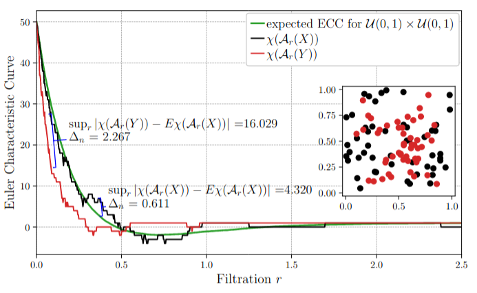
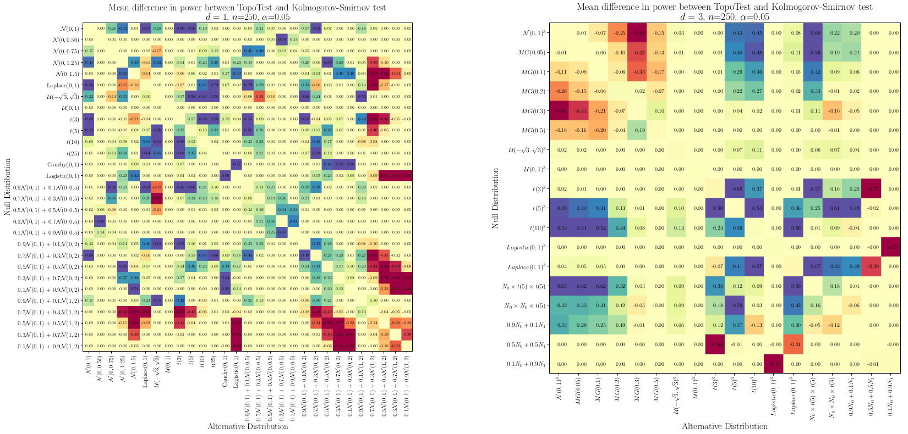

# TopoTests

## Paper
This repo contains a codebase for the paper 

**"Topology-Driven Goodness-of-Fit Tests in Arbitrary Dimensions"** 

by Paweł Dłotko, Niklas Hellmer, Łukasz Stettner and Rafał Topolnicki. 
Statistics and Computing **34**, 34 (2024) [https://doi.org/10.1007/](https://doi.org/10.1007/)

Article is and available in OpenAcess [HERE](https://link.springer.com/article/10.1007/s11222-023-10333-0)
Preprint can be find in [arXiv:2010.14965](https://arxiv.org/pdf/2210.14965.pdf)

## About TopoTests
TopoTests provides a framework for goodness-of-fit (GoF) testing in arbitrary dimensions for one-sample and two-sample problems by adapting Euler Characteristic Curve (ECC) - a tool from computational topology. To the best of our knowledge it is one of the first
attepmts to apply topologically driven approach for goodness of fit testing.
The method is designed to work well with multivariate distributions. 

## How to use?

### Instalation
You can simply install TopoTest from pip

`pip install topotest`

### Example
Example use and comparison with the Kolmogorov-Smirnov can be found in [OneSampleExample](notebooks/OneSampleExample.ipynb) and [TwoSampleExample](notebooks/TwoSampleExample.ipynb) notebooks.

## Results
Simulation study was conducted to address the power of the TopoTest in comparison with
Kolmogorov-Smirnov test. In both, one-sample and two-sample setting, the
TopoTest in many cases yielded better performance than Kolmogorov-Smirnov. 

Comparison of the power of TopoTest and Kolmogorov-Smirnov one-sample tests for collection of null-alternative distribution pairs in case of univariate, d=1, (left panel) and trivariate, d=3, (right panel) probability distributions. Sample size equals n=250.
In each matrix element a difference between power of TopoTest and Kolmogorov-Smirnov test was given. 
The difference in power was estimated based on K=1000 Monte Carlo realizations. 
The average power (excluding diagonal elements) is

- TopoTest: is 0.832 for d=1 and 0.824 for d=3
- Kolmogorov-Smirnov: 0794 for d=1 and 0.763 for d=3

Please refer to Sections 4 and 5 of [the paper](https://arxiv.org/pdf/2210.14965.pdf) for more results.

